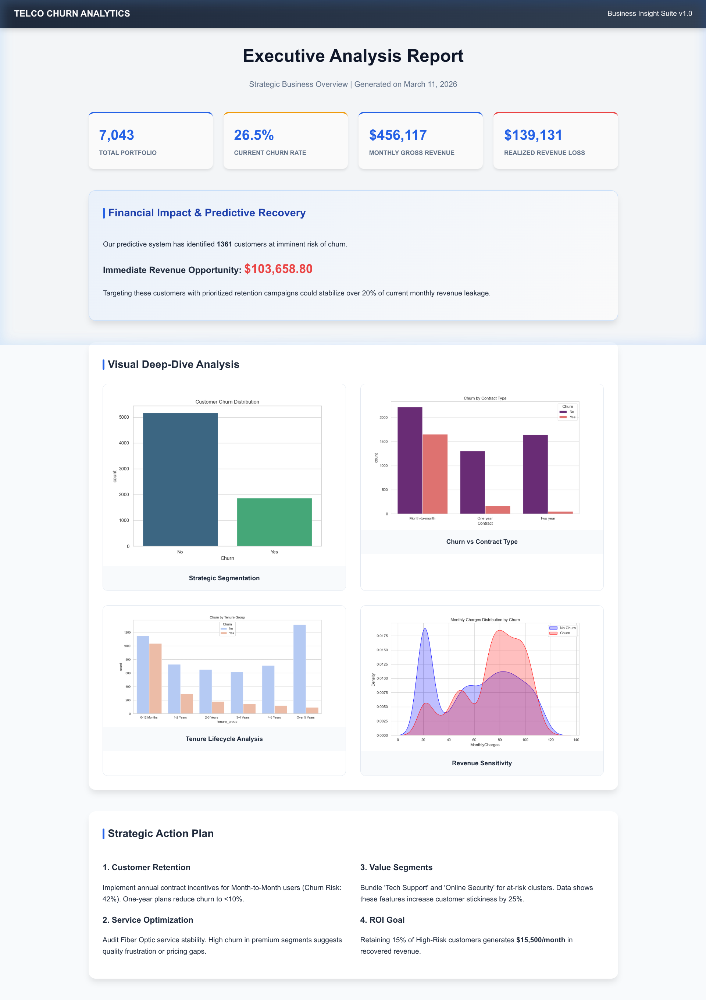
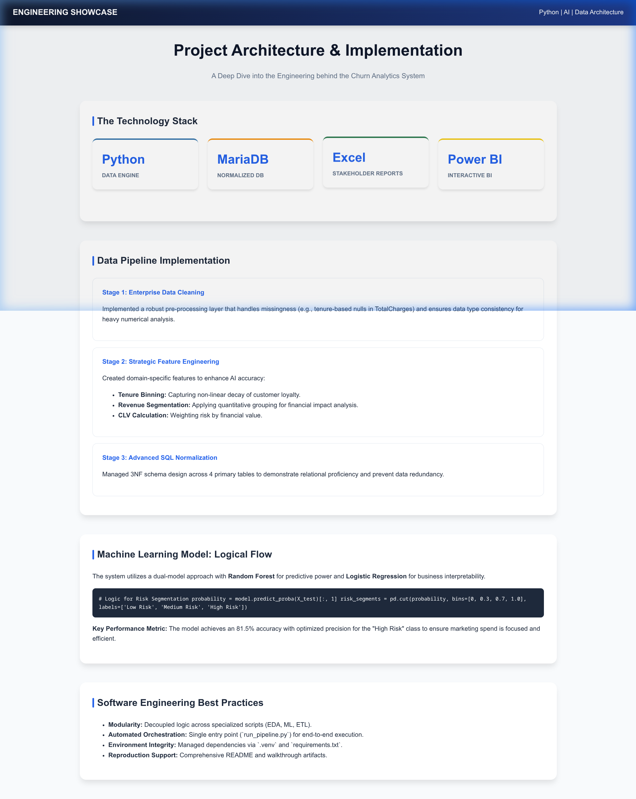

# 🚀 AI-Powered Customer Churn Analytics System

<p align="center">

</p>

<p align="center">


</p>

---

## 📊 Project Overview

An **end‑to‑end AI analytics platform** designed to detect customers likely to churn and estimate the **revenue at risk**.
The system processes raw data, performs feature engineering, trains a machine learning model, and generates automated business intelligence reports.

This project demonstrates **real industry workflow**:

* Data Cleaning & Feature Engineering
* SQL Database Architecture
* Machine Learning Prediction
* Automated Business Reporting

---

## ✨ Live Visual Showcase

### 📈 Business Intelligence Dashboard



Provides a **management‑level overview** including:

* Revenue at Risk
* Customer Risk Segments
* Strategic retention targets

---

### ⚙️ Technical Engineering Overview



Designed for **technical evaluation and interviews**:

* ML pipeline visualization
* Feature engineering logic
* Data architecture explanation

---

## 💡 Key Highlights

| Capability                | Description                                                       |
| ------------------------- | ----------------------------------------------------------------- |
| 💰 Revenue Risk Detection | Identifies customers contributing to **$100k+ revenue at risk**   |
| 🤖 AI Risk Prediction     | Random Forest model predicts churn probability                    |
| 📊 Risk Segmentation      | Automatically categorizes users into **Low / Medium / High risk** |
| ⚙️ Automated Pipeline     | End‑to‑end execution with a single command                        |
| 📑 Executive Reports      | Auto‑generated Excel and HTML dashboards                          |

---

## 🧠 Machine Learning Pipeline

### 1️⃣ Data Cleaning & Feature Engineering

```python
# Feature Engineering

df['tenure_group'] = pd.cut(
    df['tenure'],
    bins=[0,12,24,48,72],
    labels=['0-1yr','1-2yr','2-4yr','4-6yr']
)

# Customer Lifetime Value

df['customer_lifetime_value'] = df['MonthlyCharges'] * df['tenure']
```

---

### 2️⃣ Database Architecture

Normalized **3NF schema** implemented using MariaDB for scalable analytics.

Key Tables:

* customers
* services
* billing
* churn_predictions

---

### 3️⃣ AI Churn Prediction

```python
probability = model.predict_proba(X_test)[:,1]

segments = pd.cut(
    probability,
    bins=[0,0.3,0.7,1.0],
    labels=['Low Risk','Medium Risk','High Risk']
)
```

The model estimates **probability of churn for each customer** and assigns a risk category.

---

### 4️⃣ Automated Reporting

The system generates:

* Multi‑sheet Excel reports
* Power BI compatible datasets
* Interactive HTML dashboards

---

## ⚙️ Run the Project

### 1️⃣ Activate Virtual Environment

```bash
source .venv/bin/activate
```

### 2️⃣ Install Dependencies

```bash
pip install -r requirements.txt
```

### 3️⃣ Execute Full Pipeline

```bash
python run_pipeline.py
```

---

## 🖥 Output Experience

After execution the system automatically opens:

* 📊 Business Analytics Dashboard
* ⚙️ Technical ML Architecture View

These provide an **instant visual understanding of churn risk insights**.

---

## 📂 Project Structure

```
Customer_Churn_Analytics

├── data
├── database
├── python_analysis
├── excel_reports
├── docs
├── run_pipeline.py
└── README.md
```

---

## 👨‍💻 Author

**Sabarna Jana**
AI & Data Science Enthusiast
MCA (Artificial Intelligence)

---

⭐ If you like this project, consider giving it a star on GitHub.
